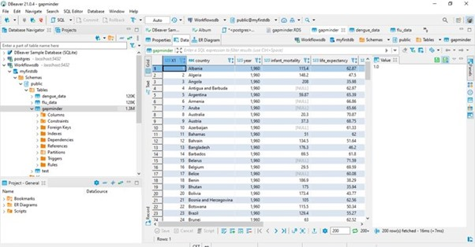

# Relational databases

In this chapter we are going to get acquainted with sql and dbever. to start, we first load 3 different datasets into Rstudio, namely the flu, dengue and gapminder dataset. And we will make them tidy.

```{r}
library(tidyverse)
library(dslabs)
gapminder <- as_tibble(gapminder)
flu_data<- read.csv(url("https://raw.githubusercontent.com/ClaudiavdZ/tlsc-dsfb26v-20_workflows/main/data/flu_data.csv"), skip = 11)
flu_data <- as_tibble(flu_data)
dengue_data<- read.csv(url("https://raw.githubusercontent.com/ClaudiavdZ/tlsc-dsfb26v-20_workflows/main/data/dengue_data.csv"), skip = 11)

```

Next we will store them as a csv and RDS file
```{r}
write.table(dengue_data , file = "dengu_data.csv")
write.table(dengue_data , file = "dengu_data.RDS")
write.table(flu_data , file = "flu_data.csv")
write.table(flu_data , file = "flu_data.RDS")
write.table(gapminder , file = "gapminder.csv")
write.table(gapminder , file = "gapminder.RDS")
```


Then we are goning to watch te data in Dbever
```{r}
library(DBI)
con <- dbConnect(RPostgres::Postgres(), 
                 dbname = "myfirstdb", 
                 host="localhost", 
                 port="5432", 
                 user="postgres", 
                 password="Veroni36") 
dbListTables(con) 
```

Here you can see what that looks like

{ width=80%}


Then we will try to put the datasets together as one dataset.
```{r}
flu_usd <- gather(
  flu_data,
  key = "country",
  value = "flu",
  Argentina:Uruguay
)
#seperate year from month and day
flu_usd <- separate(flu_usd, Date, into = c("year", "month", "day"),  sep = "-")
#count sum of flu
flu_usd <- aggregate(flu_usd$flu, by=list(year=flu_usd$year, country=flu_usd$country), FUN=sum)
flu_usd <- flu_usd %>% rename(flu = x)
flu_usd$year <- as.integer(flu_usd$year)  

dengue_usd <- gather(
  dengue_data,
  key = "country",
  value = "dengue",
  Argentina:Venezuela
)
dengue_usd <- separate(dengue_usd, Date, into = c("year", "month", "day"),  sep = "-")
dengue_usd <- aggregate(dengue_usd$dengue, by=list(year=dengue_usd$year, country=dengue_usd$country), FUN=sum)
dengue_usd <- dengue_usd %>% rename(dengue = x)
dengue_usd$year <- as.integer(dengue_usd$year)

alltogether <- left_join(flu_usd, gapminder, by = c("country", "year"))
alltogether <- left_join(alltogether, dengue_usd , by = c("country", "year"))

```

After thad we make some visualisations of the data
```{r}
flu_plot <- function(dataframe, land){
  dataframe %>% filter(country == land) %>% 
    ggplot(aes(x = year, y = flu)) +
  geom_line() +
  geom_point() 
  }

flu_plot(alltogether,"Netherlands")

alltogether %>% filter(country == "Argentina") %>%
  ggplot() + 
  geom_line(aes(y = dengue,x=year, colour = "green"),) + 
  geom_line(aes(y = flu,x=year, colour = "red"))


ggplot(data = alltogether, aes(x = continent, y = flu)) +
  geom_boxplot(aes(fill = continent))
```

```{r}
shapiro.test(alltogether$fertility)
shapiro.test(alltogether$flu)

shapiro.test(alltogether$dengue)
shapiro.test(alltogether$infant_mortality)
shapiro.test(alltogether$life_expectancy)
shapiro.test(alltogether$gdp)
shapiro.test(alltogether$population)

library(car)
leveneTest(alltogether$fertility, alltogether$flu, center = mean)
#no equal variance

leveneTest(alltogether$dengue, alltogether$infant_mortality, center = mean)
#no equal variance

leveneTest(alltogether$population, alltogether$life_expectancy, center = mean)
#no equal variance

```

