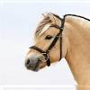
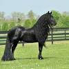

# Machine learning
This chapter contains my self-study assignment which I explained in the previous chapter. I'm going to try to train the algorithm in such a way that it can distinguish the Friesian breed from the Fjord breed. First I have to collect the data. I have collect the pictures from google, and i have select them by hand. Than I load them in rstudio an cut them so they are all the same size.

```{r}
# Load libraries
library(jpeg)
library(EBImage)

#Paths to images
fjordpath = "./ExtraOpdracht/Fjord"
friespath =  "./ExtraOpdracht/Fries"

#Paths to cut images
newfjordpath = "./ExtraOpdracht/FjordC"
newfriespath = "./ExtraOpdracht/FriesC"

#list to file names
filenames = list.files(fjordpath)

#loop through filenames
for (name in filenames) {

  # Ignore errors (not jpg files)
 tryCatch({
    # Read images
    image = readJPEG(paste(fjordpath,name, sep="/"))
    
    # Check minimum dimension and cut image according to the dimension
    mindim = min(dim(image)[1:2])
    newimage = image[1:mindim,1:mindim,1:3]
    newimage = resize(newimage, w=100, h=100)
    # Write cut image
    writeJPEG(newimage, paste(newfjordpath, name, sep="/cut_"))
    
  }, error=function(e){})
}

# same but for friesian horse images
filenames = list.files(friespath)
for (name in filenames) {
  
  tryCatch({
    image = readJPEG(paste(friespath,name, sep="/"))
    mindim = min(dim(image)[1:2])
    newimage = image[1:mindim,1:mindim,1:3]
    newimage = resize(newimage, w=100, h=100)
    writeJPEG(newimage, paste(newfriespath, name, sep="/cut_"))
    
  }, error=function(e){})
}

```

As you can see below the images are cut and the same side now.



Now we are going to make and test model.
```{r}
#devtools::install_github("rstudio/reticulate")
#tensorflow::install_tensorflow(extra_packages='pillow')
#tensorflow::install_tensorflow(extra_packages='SciPy')
library(tidyverse)
library(keras)
library(tensorflow)
library(reticulate)

#index labels 
#0=fjord 1=fries
label_list <- dir("data/Machine_learning/Train/")
#rescale size
width <- 224
height<- 224
target_size <- c(width, height)
rgb <- 3 #color channels

path_train <- "data/Machine_learning/Train/"
#rescale pixel values between 0-1 and split off 20% of training data used as validation data 
train_data_gen <- image_data_generator(rescale = 1/255, 
                                       validation_split = .2)
#make batches of the data in the directory (default = 32)
#batches are sets of images
train_images <- flow_images_from_directory(path_train,
                                           train_data_gen,
                                           subset = 'training',
                                           target_size = target_size,
                                           class_mode = "binary",
                                           shuffle=F,
                                           classes = label_list,
                                           seed = 2021)
validation_images <- flow_images_from_directory(path_train,
                                                train_data_gen, 
                                                subset = 'validation',
                                                target_size = target_size,
                                                class_mode = "binary",
                                                classes = label_list,
                                                seed = 2021)
#load xception model and removes the input layer https://arxiv.org/abs/1610.02357
mod_base <- application_xception(weights = 'imagenet', 
                                 include_top = FALSE, input_shape = c(width, height, 3))
#make sure the exception weights don't change while training, only change the self appended layers
freeze_weights(mod_base) 
#specify model parameters
model_function <- function(learning_rate = 0.001, 
                           dropoutrate=0.2, n_dense=1024){
  
  k_clear_session()
  #build model, append layers to exception model
  model <- keras_model_sequential() %>%
    mod_base %>% 
    layer_global_average_pooling_2d() %>% 
    layer_dense(units = n_dense) %>%
    layer_activation("relu") %>%
    layer_dropout(dropoutrate) %>%
    layer_dense(units=1, activation="sigmoid")
  #compile model
  #use binary_crossentropy loss
  #use adem optimizer https://arxiv.org/abs/1412.6980
  #keep track of accuracy metric
  model %>% compile(
    loss = "binary_crossentropy",
    optimizer = optimizer_adam(lr = learning_rate),
    metrics = "accuracy"
  )
  
  return(model)
  
}
#visualize model
model <- model_function()
model
batch_size <- 32
#numer of times the network will see all of the images
epochs <- 6
#train model
hist <- model %>% fit(
  train_images,
  steps_per_epoch = train_images$n %/% batch_size, 
  epochs = epochs, 
  validation_data = validation_images,
  validation_steps = validation_images$n %/% batch_size,
  verbose = 1
)

path_test <- "data/Machine_learning/Test/"
test_data_gen <- image_data_generator(rescale = 1/255)
test_images <- flow_images_from_directory(path_test,
                                          test_data_gen,
                                          target_size = target_size,
                                          class_mode = "binary",
                                          classes = label_list,
                                          shuffle = F,
                                          seed = 2021)
#test model
model %>% evaluate(test_images, 
                             steps = test_images$n)
test_image <- image_load("data/Machine_learning/Test/Fries/cut_Fries027.jpg",
                         target_size = target_size)
x <- image_to_array(test_image)
x <- array_reshape(x, c(1, dim(x)))
x <- x/255
pred <- model %>% predict(x)
pred

```
As you can see the algoritme has it almost completely good.This algorithm is therefore able to classify almost all photos correctly.
